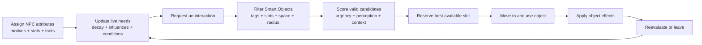
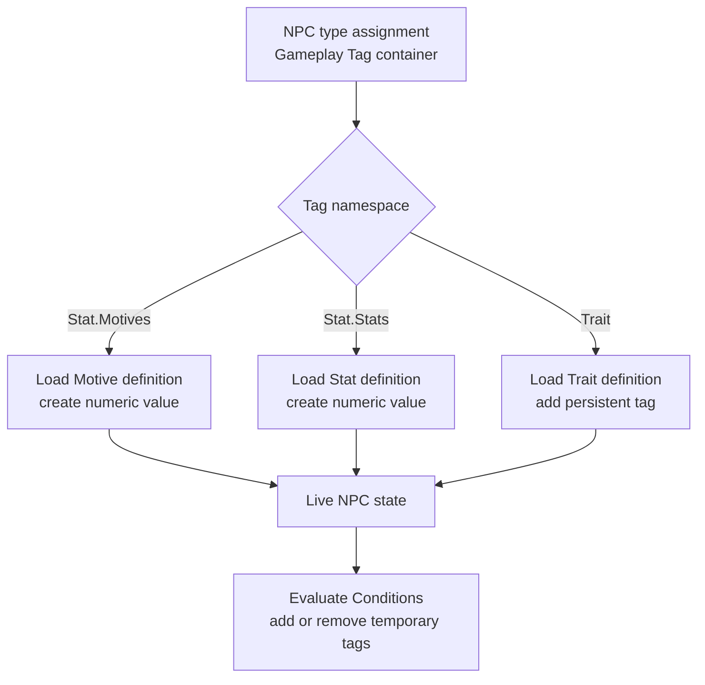
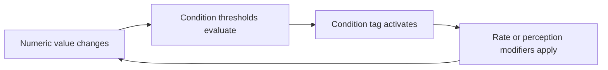
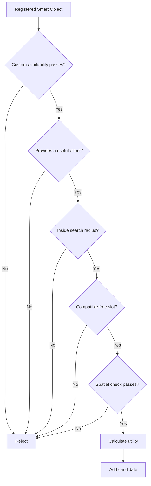
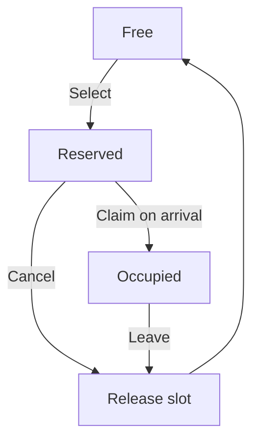
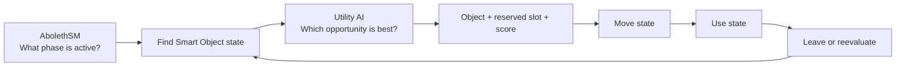

# Aboleth Utility AI

### A tag-driven NPC decision and Smart Object system for Unreal Engine

Aboleth Utility AI lets NPCs evaluate world interactions according to their current needs, persistent traits, temporary conditions, distance, social context, and slot compatibility. It combines a typed character-stat model with data-driven Smart Objects, curve-based urgency, source-tracked effects, periodic reevaluation, and Blueprint-facing APIs.

> **Source status:** Private production code. This case study uses small, abridged excerpts to explain the engineering without distributing the complete implementation.

## Project context

The system is part of the Aboleth gameplay framework and is designed for simulation-driven NPC behavior. It composes directly with **AbolethSM**: a state machine can request the best Smart Object, move toward the reserved slot, use the object, and return for another decision.

The goal is not to script one fixed behavior tree. Designers describe what an NPC needs, what an object provides, and who can use each slot. The runtime resolves the best valid interaction from the current world state.

## Project snapshot

| | |
|---|---|
| **Role** | Systems design, C++ implementation, data architecture, Blueprint integration |
| **Engine** | Unreal Engine 5.7 |
| **Technology** | C++, Gameplay Tags, Data Tables, Curve Tables, Actor Components, Game Instance Subsystems, Blueprint APIs |
| **Architecture** | Stats component + Smart Object component + centralized Utility subsystem |
| **Current scale** | Approximately 6,800 lines across 17 private C++ source files |
| **Status** | Beta, active development |

## The gameplay workflow



### 1. Define the NPC

An NPC type is assigned a container of Gameplay Tags. Those tags identify which motives, stats, and traits should be loaded from project Data Tables.

### 2. Define world opportunities

A Smart Object definition describes:

- Which numeric needs it affects.
- The real rate of change applied while it is in use.
- How valuable the effect appears during decision-making.
- Trait and condition modifiers that alter that perception.
- Minimum, maximum, and reevaluation usage times.
- Distance-penalty behavior.
- One or more reservable interaction slots.

### 3. Ask for the best interaction

The Utility subsystem gathers registered Smart Objects, removes candidates the NPC cannot use, scores the remaining choices, sorts them by utility, and attempts to reserve a compatible slot.

### 4. Execute through the state machine

The resulting object and slot are passed to gameplay. AbolethSM can own the readable behavior sequence—find, move, use, leave—while Utility AI decides which world opportunity currently makes the most sense.

## Attribute model

The system deliberately separates values from labels:

| Type | Runtime representation | How it behaves |
|---|---|---|
| **Motive** | Gameplay Tag + `float` | A need such as hunger or energy. Changes over time, has a weight, urgency threshold, response curve, and forecast horizon. |
| **Stat** | Gameplay Tag + `float` | A more stable numeric attribute. Uses an initial value and an optional base rate of change. |
| **Trait** | Gameplay Tag | A persistent qualitative attribute. Modifies stat rates and the perceived value of Smart Object effects. |
| **Condition** | Gameplay Tag | A temporary state activated by numeric threshold rules. Can modify stat rates and object perception while active. |
| **Influence** | Tagged numeric rate + source | A runtime effect applied by an active Smart Object or another gameplay source. Removed by the same source when the effect ends. |

All numeric Motives and Stats use a normalized `0–100` range. Traits and Conditions do not pretend to be arbitrary numbers; their presence in the NPC’s live tag container is the data.

An abridged view of that separation:

```cpp
// Numeric state: only Motives and Stats store float values.
TMap<FGameplayTag, float> MotiveAndStatValues;

// Qualitative state: identity tags, Traits, and active Conditions.
FGameplayTagContainer NPCGameplayTags;
```

This makes designers choose an appropriate representation. “Energy is 24” is a Motive value. “Exhausted” is a Condition derived from that value. “Energetic” is a persistent Trait that can change how quickly Energy falls or how activities are perceived.

## Gameplay Tags as the shared language

Gameplay Tags provide stable identifiers across Data Tables, NPC state, Smart Object definitions, Blueprint nodes, and state-machine data pins.

The implementation uses tag namespaces to distinguish attribute families:

```text
Stat.Motives.*
Stat.Stats.*
Trait.*
Condition.*
```

At initialization, an NPC assignment row provides a `FGameplayTagContainer`. The Stats component resolves each assigned tag against the appropriate definition table:



The same live container then answers different questions:

- Does this NPC have a Trait that changes perception?
- Is a threshold-driven Condition currently active?
- Does the NPC satisfy a slot’s Gameplay Tag Query?
- Which attribute definition owns a numeric value?

This prevents separate systems from inventing incompatible enums or string identifiers for the same character concept.

## How Traits work

A Trait is a permanent tag plus a data definition. It does not store a changing value.

Each Trait can contribute rate modifiers to selected Motives or Stats. During periodic stat processing, all active Trait and Condition definitions are inspected and their matching modifiers are combined with the base rate.

Traits can also change how an NPC perceives a Smart Object effect. The actual effect remains unchanged; only the decision score changes.

```cpp
// Abridged from the private perception evaluator.
float PerceivedValue = Effect.PerceivedEffectValue;

for (const FAbolethPerceptionModifier& Modifier : Effect.PerceptionModifiers)
{
    if (NPCGameplayTags.HasTag(Modifier.NPCTag))
    {
        PerceivedValue += Modifier.PerceptionModifier;
    }
}

return FMath::Clamp(PerceivedValue, -100.0f, 100.0f);
```

For example, two NPCs can receive the same real benefit from an activity while valuing it differently because one has a matching social, cautious, impatient, or risk-oriented Trait.

That distinction is important:

| Smart Object value | Used for |
|---|---|
| **Effect Value** | The actual per-second change applied to the NPC while using the object |
| **Perceived Effect Value** | The base desirability used during scoring |
| **Perception Modifier** | A tag-specific adjustment to desirability |

## How Conditions work

Conditions turn numeric state into temporary qualitative state. Each definition contains one or more threshold requirements and optional stat-rate modifiers.

```cpp
// Abridged threshold evaluation.
const bool bMet = Requirement.bIsGreaterThan
    ? CurrentValue > Requirement.Value
    : CurrentValue < Requirement.Value;

if (bAllRequirementsMet)
{
    NPCGameplayTags.AddTag(ConditionTag);
}
else
{
    NPCGameplayTags.RemoveTag(ConditionTag);
}
```

This creates a feedback loop:



A Condition can therefore affect both how quickly needs evolve and which activities appear desirable, without hard-coding condition names into the evaluator.

## Slot compatibility through tag queries

Every Smart Object can expose multiple slots. A slot tracks:

- A stable Slot ID.
- A local transform converted to world space for movement.
- Free, Reserved, or Occupied state.
- The reserving or occupying NPC.
- An optional Gameplay Tag Query.
- An optional spatial-clearance test.

An empty query makes the slot universally compatible. Otherwise, Unreal’s `FGameplayTagQuery` evaluates the NPC’s live tag container:

```cpp
bool IsCompatible(
    const FGameplayTagQuery& SlotQuery,
    const FGameplayTagContainer& NPCTags)
{
    return SlotQuery.IsEmpty() || SlotQuery.Matches(NPCTags);
}
```

Because this is a full Gameplay Tag Query rather than one required tag, a slot can express compound rules such as:

- Require every tag in a set.
- Accept any tag from a set.
- Exclude one or more Conditions.
- Combine nested all/any/none expressions.

Compatibility is checked before scoring and checked again when finding a usable slot. Optional collision overlap checks prevent a logically free slot from being selected when its physical interaction space is blocked.

## Candidate selection

The selection pipeline rejects invalid choices before spending time ranking them:



After gathering, candidates are sorted from highest to lowest utility. The subsystem attempts slot reservation in that order. If the best slot becomes unavailable during selection, the next ranked candidate can still succeed.

This treats reservation as part of the decision transaction rather than returning an attractive object that the NPC cannot actually claim.

## Utility scoring

Each Smart Object effect contributes independently to the total score:

```cpp
const float EffectUtility =
    CurrentUrgency
    * MotiveWeight
    * FinalPerceivedValue
    * 0.01f;
```

The inputs have separate responsibilities:

- **Current urgency** comes from a designer-authored Curve Table row evaluated against the current `0–100` Motive value.
- **Motive weight** describes the relative importance of that need.
- **Final perceived value** combines the object’s base perception with every matching Trait or Condition modifier.

The effect contributions are summed, then adjusted by:

- A social bias based on partial occupancy of multi-slot objects.
- A logarithmic distance penalty with per-object configuration.

The social term uses an occupancy curve that peaks around half capacity. Empty objects receive no social bonus, partly occupied group objects become more attractive, and completely full objects cannot accept another NPC.

The final score is clamped to zero or above. A candidate with no positive utility is discarded.

### Current versus forecast data

The Stats component can estimate a future value from the current rate of change:

```cpp
ForecastValue = FMath::Clamp(
    CurrentValue + RateOfChange * SecondsAhead,
    0.0f,
    100.0f);
```

The evaluator currently records current values, forecasts, urgency, individual contributions, distance penalties, and social bias for diagnostics. The production score shown above still uses **current urgency**; forecast values are not yet an input to the final score.

That boundary is documented deliberately so the case study does not claim predictive scoring that the current implementation does not perform.

## Applying and removing effects

Selecting an object does not immediately modify the NPC. The effect begins only after the reserved slot is validated and claimed.

While an NPC uses the object, every effect is registered with the Stats component as a source-tracked influence:

```cpp
// Entering the Smart Object.
Stats.RegisterStatInfluence(
    Effect.StatTag,
    Effect.EffectValue,
    SmartObjectSource);

// Leaving the Smart Object.
Stats.UnregisterStatInfluence(
    Effect.StatTag,
    SmartObjectSource);
```

The Stats component combines all active influences affecting the same attribute. Tracking the source allows one object to remove only its own contribution without erasing effects from other gameplay systems.

The slot lifecycle is explicit:



Cancellation returns a reservation to Free when the NPC abandons it or final spatial validation fails. Leaving releases an Occupied slot through the same cleanup path.

Joining and leaving also broadcast Blueprint delegates, call overridable events, update subsystem usage tracking, and activate or stop the Smart Object’s custom state behavior.

## Reevaluation without constant decision spam

The system does not run a full selection pass every frame.

- The Stats component updates through a one-second timer instead of component Tick.
- The Utility subsystem reevaluates active object usage on a configurable timer.
- Each Smart Object can define a minimum commitment time.
- Alternatives are checked at configured intervals with an optional low random recheck chance.
- A maximum usage time can force a new choice.
- Auto-switching can be disabled for interactions controlled by their own gameplay flow.

NPC switches are collected during evaluation and applied afterward, avoiding mutation of the usage map while it is being traversed.

## Runtime debugging

Console-controlled logs can trace candidate rejection, effect contributions, reservation attempts, and switching decisions. In-world debug drawing can visualize slot transforms, Free/Reserved/Occupied state, spatial checks, and the NPC associated with a slot.

## How it composes with AbolethSM

The two systems own different decisions:



AbolethSM keeps temporal behavior readable. Utility AI ranks world opportunities. Smart Objects own interaction capacity and effects. The Stats component owns character state.

That separation prevents the state machine from becoming a scoring engine and prevents the Utility subsystem from becoming a movement or animation controller.

## Current evidence

| Engineering objective | Current evidence |
|---|---|
| Data-driven character modeling | Separate Data Table definitions for Motives, Stats, Traits, Conditions, and NPC assignments |
| Stable cross-system identity | Gameplay Tags shared by numeric state, definitions, queries, Blueprint, and state-machine data |
| Personalized decisions | Trait and Condition tags modify effect perception without changing real object effects |
| Valid interaction selection | Availability, radius, tag-query, slot-state, and spatial filtering before ranking |
| Contention handling | Ranked reservation attempts fall back to the next candidate if a slot cannot be claimed |
| Multi-need decisions | Each Smart Object effect contributes independently to the final score |
| Runtime effect ownership | Source-tracked influences are registered on join and removed on leave |
| Controlled reevaluation | Minimum/maximum usage time, interval checks, optional random checks, and deferred switching |
| Blueprint integration | Blueprint-callable selection, stat access, lifecycle events, delegates, and overridable availability |
| Debuggability | Console-controlled evaluation logs and in-world slot, occupancy, spatial-check, and NPC visualization |

## Current limitations and next steps

- Add Unreal Automation coverage for tag queries, condition activation, scoring, slot contention, and influence cleanup.
- Decide how forecast values should affect selection and validate that behavior independently from current-urgency scoring.
- Profile large NPC and Smart Object populations, then introduce spatial indexing if linear candidate gathering becomes a bottleneck.
- Cache repeated Data Table lookups and other stable definition data where profiling justifies it.
- Continue reducing development-only logging in production configurations.

---

Built by [JMathisPluto](https://github.com/JMathisPluto).

© 2026 JMathisPluto. All rights reserved. The excerpts in this case study are abridged for explanation and do not grant permission to copy, redistribute, reverse engineer, or use the underlying proprietary implementation.
